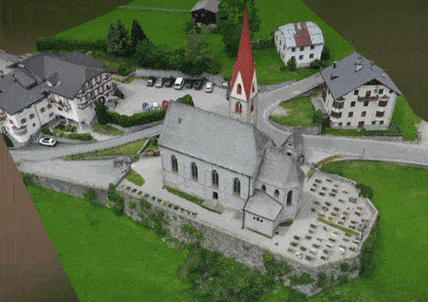

Photogrammetry Data Set of Church in Rein in Taufers
=================

A Dataset containing drone images used for photogrammetry reconstruction. The subject is a church in South Tyrol, in the village of Rein in Taufers. 

The repo also contains a PPI license for Reality Capture. So if you are using RC, you can reconstruct this data set with no additional costs on you. 

You can see an example reconstruciton in my sketfab: https://skfb.ly/6TW8s

License
=================

This is licensed under CC, so you can almost do anything with it. When using the data set and sharing it, please credit this work in the following format, name, place name, capture date, and link to this repo: 

Name: Shahriar Shahrabi

Location: Rein in Taufers

Link: https://github.com/IRCSS/Tyrol-Church-Photogrammetry-Dataset

Capture Date: 14.7.2020

---

Shield: [![CC BY 4.0][cc-by-shield]][cc-by]

This work is licensed under a
[Creative Commons Attribution 4.0 International License][cc-by].

[![CC BY 4.0][cc-by-image]][cc-by]

[cc-by]: http://creativecommons.org/licenses/by/4.0/
[cc-by-image]: https://i.creativecommons.org/l/by/4.0/88x31.png
[cc-by-shield]: https://img.shields.io/badge/License-CC%20BY%204.0-lightgrey.svg